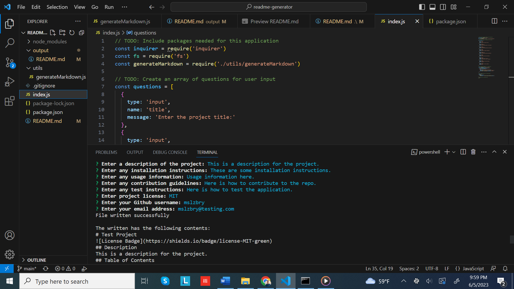

# README Generator

## Description

This node app is a command line tool that can be run to generate a professional README file based on user input. The project uses the inquirer library to prompt the user to enter information for the README including the title, description, usage, contributing, testing, license, and questions sections. The app then generates a README.md file in the output directory, and includes a table of contents. This is handy and reduces the manual labor of having to remember markdown syntax and doing it every time per app.

## Table of Contents

- [Description](#description)
- [Installation](#installation)
- [Usage](#usage)
- [Contributing](#contributing)
- [Tests](#tests)
- [License](#license)
- [Questions](#questions)

## Installation

To install and run this command line tool, clone the repo. Go in the project root directory and run an "npm install" to install the libraries required by the app and specified in the package.json.

## Usage

To run the app, open a Terminal run "node index.js" to run the application. This assumes you have nodejs already installed on your machine. If not, go to the https://nodejs.org/en/download to install it. Below is a screenshot that shows what the command line will look like.

Here is a [Google Drive link](https://drive.google.com/file/d/1D6gqg_TeAQ2qnLkMOuVLluRmhwL66K2p/view?usp=sharing) to a demo of the application

## Contributing

To contribute to the repo, please clone or fork the repo, and make a pull request for my review.

## Tests

There is no testing suite set up for this application currently.

## License

This application uses the MIT license. Please see
https://mit-license.org/ for more information on this license

## Questions

You can find me [HERE](https://github.com/mslzbry) on Github.
Feel free to email me at mslzbry@test.com if you have any additional questions.
